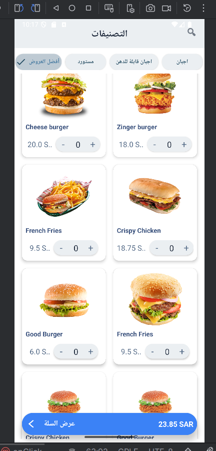

# KartngoApp
This is a demo Android app that replicates the provided product listing screen using **MVVM** architecture and **ProxyAI assistance**.  
The app allows users to browse items, increase/decrease quantity, and view total price in a bottom bar.


## Final UI 
| My App (Emulator)                   | Provided Design                  |
|-------------------------------------|----------------------------------|
|  |  |

---

## ProxyAI Prompts 
### Prompt 1: create a java class named Product with following: - String productName  -double productPrice   - int productQuantity   -int image     include constructor,getters,setters
### Response 1: complete Java class Product with the requested fields, constructor, getters, and setters
**Used for:** `model/Product.java`  
**Commit:** `11d8799`
 
### Prompt 2: Generate ProductViewModel with LiveData
### Response 2: complete Java ViewModel class named ProductViewModel that uses LiveData to expose a list of Product objects and calls a method from ProductRepo to get the product data.
**Used for:** `viewmodel/ProductViewModel.java`  
**Commit:** `260a614`


##  How to Run

1. Clone this repo
2. Open with Android Studio
3. Build and run on an emulator
4. Data is hardcoded via `ProductRepo`


##  Demo Functionality

- Tap product: shows Toast with product name
- `+ / -` buttons: adjust quantity

##  Architecture & Tools

-  **MVVM** (Model-View-ViewModel)
-  ViewModel + LiveData
-  Dummy Data via Repository
-  ProxyAI-assisted code generation


##  Folder Structure

```
├── model/
│   └── Product.java
├── viewmodel/
│   └── ProductViewModel.java
├── ui/
│   └── ProductAdapter.java
│       
│   └── MainActivity.java
├── data/
│   └── ProductRepo.java

```


